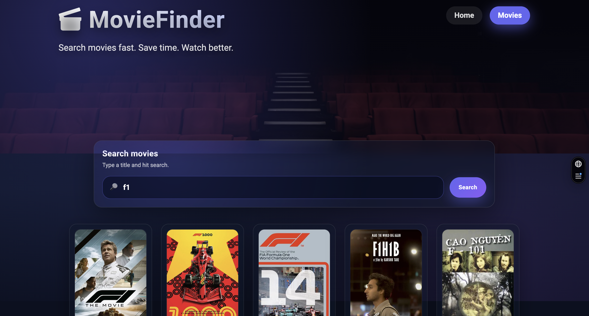
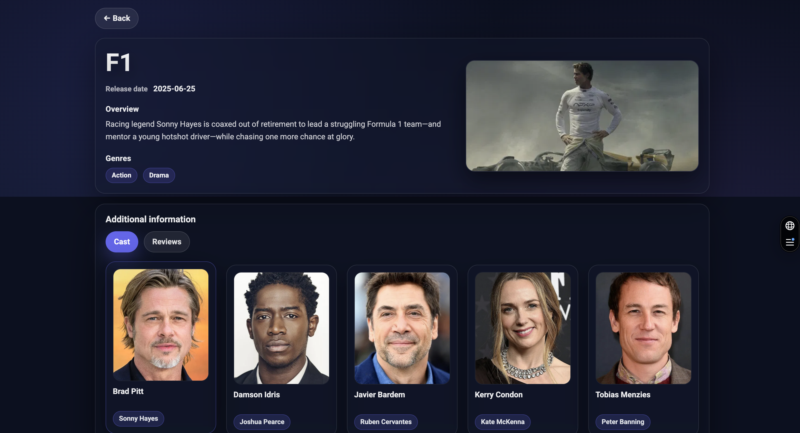

🎬 Movie Finder

🌍 Live Demo
👉 https://movie-finder-ebon-zeta.vercel.app/

📸 Screenshots

🏠 Home Page

🔎 Search Page

🎥 Movie Details

✨ Features

🔍 Instant movie search
🎬 Detailed movie pages
👥 Cast information
📝 Reviews section
⚡ Lazy loading (React Suspense)
🎨 Glassmorphism cinematic UI
📱 Fully responsive design
🔄 Client-side routing
🚀 Fast API data fetching

🧠 Architecture Highlights
Component-driven structure
Separation of UI + logic layers
Reusable UI components
Scalable routing system
Environment-based configuration

🛠 Tech Stack

Frontend
React
React Router DOM
Axios
CSS Modules
React Hot Toast
React Spinners
API
TMDB (The Movie Database)

📂 Project Structure

src
┣ components
┣ pages
┣ services
┣ hooks
┣ styles
┗ utils

🚀 Getting Started

Clone project
git clone https://github.com/Anastasiia-git/MovieFinder.git
cd movie-explorer
Install dependencies
npm install
Run locally
npm run dev

🔑 Environment Variables

Create .env file in root:
VITE_API_KEY=your_api_key_here
⚠️ Never commit API keys.

🎯 Project Goals

This project was built to strengthen real-world frontend development skills:
API integration
Routing architecture
State management patterns
Scalable component design
UX/UI polish

🧩 Possible Future Improvements

Favorites / Watchlist
Pagination
Debounced search
Skeleton loaders
Unit testing
Dark/light theme toggle

👨‍💻 Author

Anastasiia Totska
GitHub → https://github.com/Anastasiia-git

📄 License

Educational project — free to use for learning purposes.
