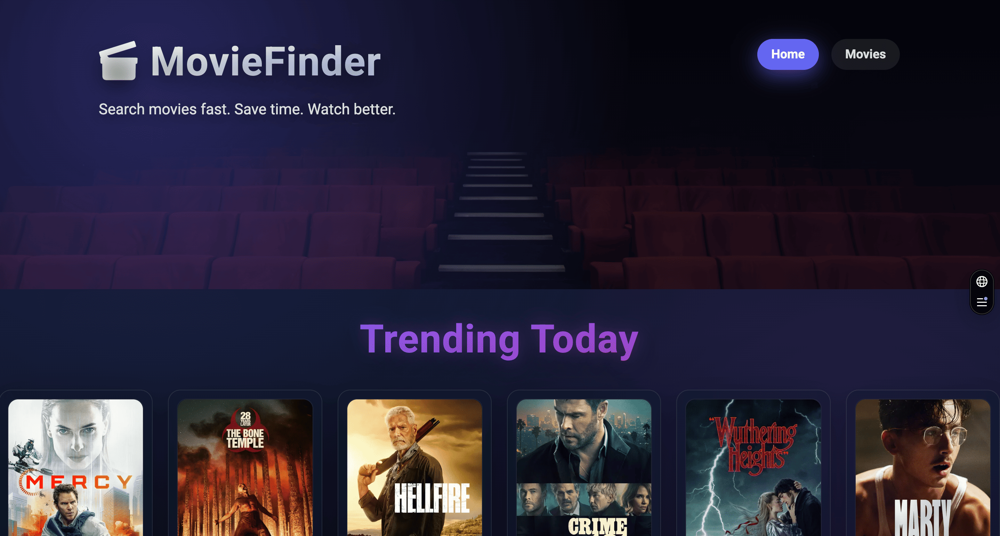
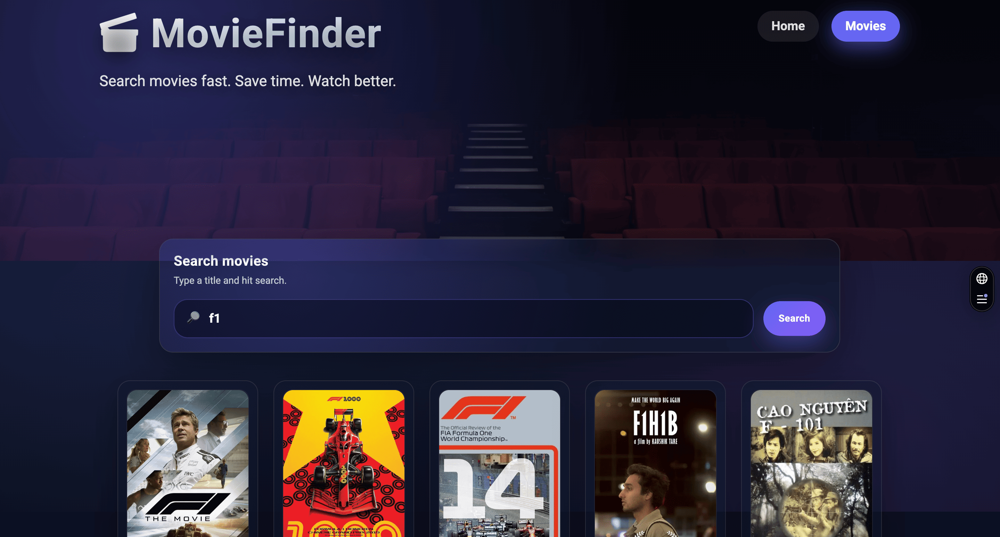
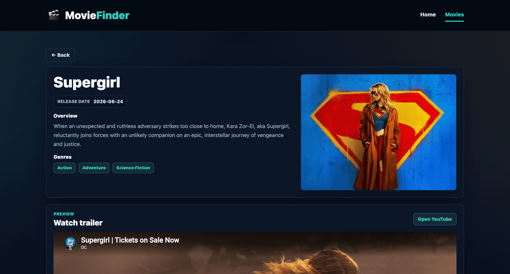

# Movie Finder

Movie Finder is a responsive React application for searching movies and viewing details from The Movie Database API.

## Live Demo

[Open Movie Finder](https://movie-finder-ebon-zeta.vercel.app/)

## Screenshots

### Home Page



### Search Page



### Movie Details



## Features

- Trending movies on the home page
- Movie search with query params in the URL
- Movie details page with release date, overview, genres, cast, and reviews
- Client-side routing with nested routes
- Loading and empty states
- Responsive layout for desktop, tablet, and mobile screens

## Tech Stack

- React
- React Router DOM
- Axios
- CSS Modules
- React Hot Toast
- React Spinners
- Vite
- TMDB API

## Project Structure

```text
src
|-- components
|-- pages
|-- services
|-- App.jsx
|-- App.css
|-- index.css
|-- main.jsx
```

## Requirements

- Node.js 18 or later
- TMDB read access token

## Getting Started

Clone the project:

```bash
git clone https://github.com/Anastasiia-git/MovieFinder.git
cd MovieFinder
```

Install dependencies:

```bash
npm install
```

Create a `.env` file in the project root:

```bash
VITE_TMDB_TOKEN=your_tmdb_read_access_token
```

Run the project locally:

```bash
npm run dev
```

## Available Scripts

```bash
npm run dev
npm run build
npm run lint
npm run preview
```

## What This Project Shows

- Working with REST API data in React
- Building route-based pages with React Router
- Keeping UI components reusable and easy to read
- Managing loading, empty, and error states
- Styling with CSS Modules and responsive breakpoints

## Future Improvements

- Add pagination for search results
- Add a favorites or watchlist feature
- Add debounced search input
- Add skeleton loaders
- Add basic component tests

## Author

Anastasiia Totska

[GitHub](https://github.com/Anastasiia-git)
